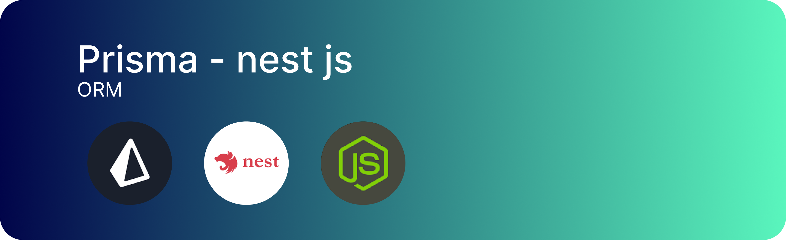

### Prisma Database


Este é um guia de passos simplificados para criar uma estrutura minima do prisma ORM no nest js

#### 1. Instalando a cli do nest js

```bash
npm i -g @nestjs/cli
```

#### 2. Iniciando o projeto nest js

```bash
npx nest new nome-do-projeto
```

#### 3. Dentro da pasta raiz

Dentro da pasta raiz do projeto iniciado,inicie a instalação das dependencias necessarias

```bash
npm i prisma @prisma/client
```

Com as dependencias instaladas agora inicie o comando

#### 4. Inicie os arquivos necessarios

```bash
npx prisma init
```

Este comando ira executar o inicio da implementação do prisma ORM, a seguir faça a configuração da URL de dados sigiloso na _ENV_ do projeto com modelo pre estabelecido
Em "ENV"

#### 5. configure os dados ENV necessarios para conexão

O arquivo env geradado automaticamente na base raiz do projeto

```
DATABASE_URL="mysql://name_user:password@ip_adress:port/path_for_table_in_database?schema=public"
```

#### 6. Faça a configuração necessaria do arquivo schema.prisma

Com este arquivo configurado altere os dados em **_schema.prisma_**
exemplo:

```prisma
generator client {
  provider = "prisma-client-js"
}

datasource db {
  provider = "digite_o_nome_drive_SGB"
  url      = env("DATABASE_URL")
}
```

#### 7. Execute o comando que irar configurar o necessarios e gerar os demais processos

gera alteração no arquivo schema.prisma
gera alteração nos arquivos prismas internos localizados no node_modules

Com tudo ja configurado inicie o comando para obter a class **_schema.prisma_** configurada com os dados estruturais da base de dados SGBD
execute:

```bash
npx prisma db pull
```

```bash
npx prisma generate
```

Agora o arquivo **_schema.prisma_** esta configurado com os dados necessarios

Ir para o [Passo 2](Passo_2/README.md)
